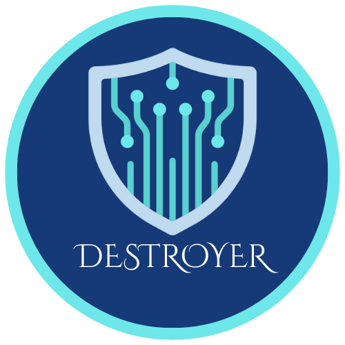

# Destroyer



Destroyer is a powerful and secure cross-platform data destruction tool designed for permanently erasing data from storage devices. It provides cryptographic proof of erasure through professional certificates, and can be controlled both locally and remotely, making it a flexible solution for data sanitization.

## Key Features

* **Multiple Wipe Modes:** Choose the level of security you need, from a quick single-pass wipe to a forensic-level hardware erase.
    * **Quick:** A 1-pass software wipe.
    * **Paranoid:** A 3-pass software wipe based on the DoD 5220.22-M standard.
    * **Crypto:** A hardware-based secure erase command.
    * **Forensic:** The most secure hardware erase, which also removes hidden data areas like HPA/DCO.
* **Cross-Platform:** The wiping engine and device detection work on both **Windows** and **Linux** systems.
* **Professional Certification:** After every successful wipe, Destroyer generates a certificate of data destruction in three formats:
    * A detailed **JSON** file for machine parsing.
    * A professional **PDF** document for auditing and record-keeping.
    * A scannable **QR Code** for quick verification.
* **Remote Wipe Capability:** Run a secure agent on a target machine and trigger the wipe from a controller anywhere on your network using a secure API.
* **Interactive Controller:** A user-friendly Command-Line Interface (CLI) that guides you through local wipes, remote wipes, and safe simulations.
* **Safe Demo Mode:** Run a full simulation of any wipe process on any drive. This generates a sample watermarked certificate without destroying any actual data, perfect for testing and demonstrations.

## Installation

1.  **Prerequisites:**
    * Python 3.8+
    * `pip` for installing packages

2.  **Clone the Repository:**
    ```bash
    git clone https://github.com/sharma19d/DESTROYER3.git
    cd DESTROYER
    ```

3.  **Set up a Virtual Environment (Recommended):**
    ```bash
    python3 -m venv venv
    source venv/bin/activate  # On Windows, use `venv\Scripts\activate`
    ```

4.  **Install Dependencies:**
    Install all the required libraries from the `requirements.txt` file.
    ```bash
    pip install -r requirements.txt
    ```

## Usage

Destroyer is controlled via the main interactive CLI. All commands should be run from within the `backend` directory.

```bash
cd backend
python3 wiple_cli.py

